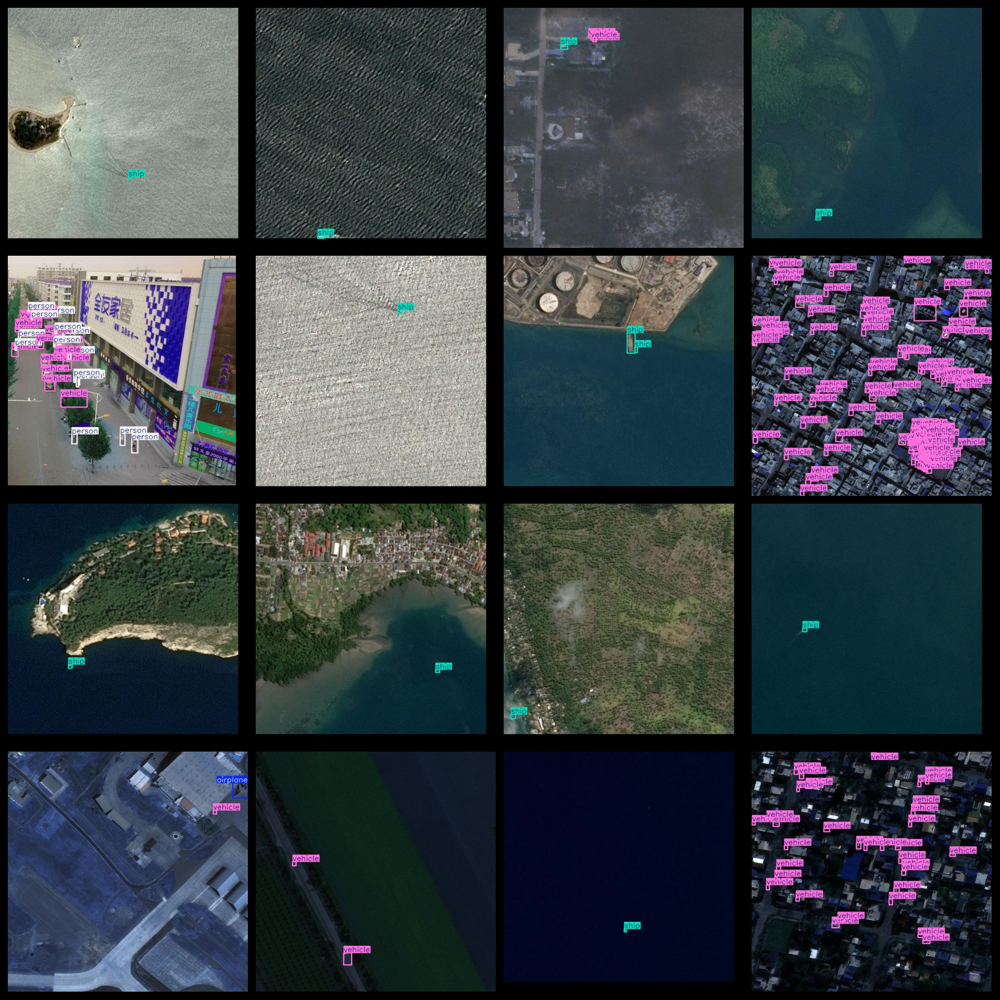
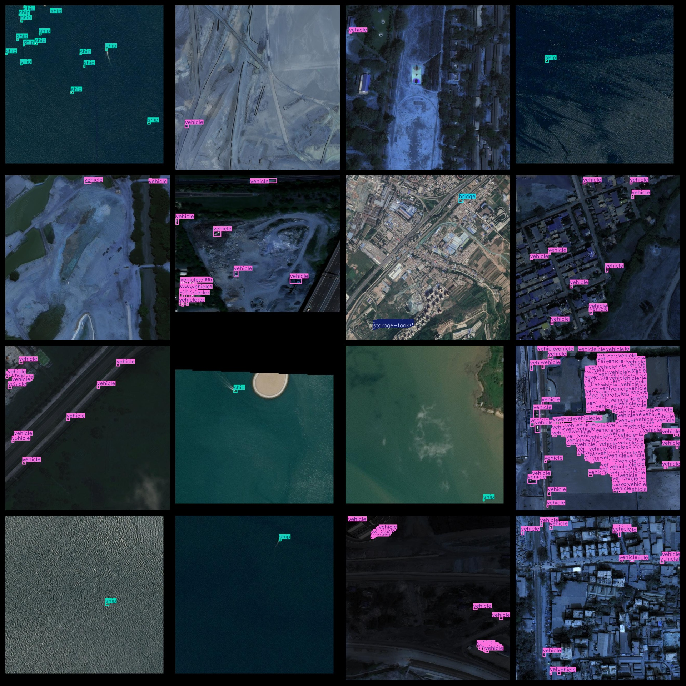

# UAV Aerial Multi-Object Detection Dataset 6999 Images VOC+YOLO Format

This dataset is a collection of drone aerial multi-object detection images, organized in the VOC+YOLO format. It consists of three folders: JPEGImages, Annotations, and labels.

The JPEGImages folder contains a total of 6999 JPEG images.

The Annotations folder contains a total of 6999 XML files.

The labels folder contains a total of 6999 txt files.

There are a total of 7 label types: "airplane", "bridge", "person", "ship", "storage-tank", "vehicle", and "wind-mill".

Each label type has a corresponding number of frames (note that the yolo format category order does not correspond to this, but rather to the classes.txt file in the labels folder).

- airplane: 332 frames
- bridge: 107 frames
- person: 5555 frames
- ship: 6720 frames
- storage-tank: 1980 frames
- vehicle: 190006 frames
- wind-mill: 126 frames
- Total frames: 204826

The images are all of high resolution clarity.

The images have not been enhanced.

The labels are rectangular boxes, used for target detection recognition.

Important Notes: No guarantees are made regarding the accuracy or reliability of the trained models or weight files. The dataset provides accurate and reasonable annotations only.

Annotation and Image Details:

## Images

---

Here is a pay link on Stripe (https://buy.stripe.com/3cs8yP7sY87d0vu9AB). Please contact me lonlonago@foxmail.com after funding $89, and I will send you a complete data files, thank you!

